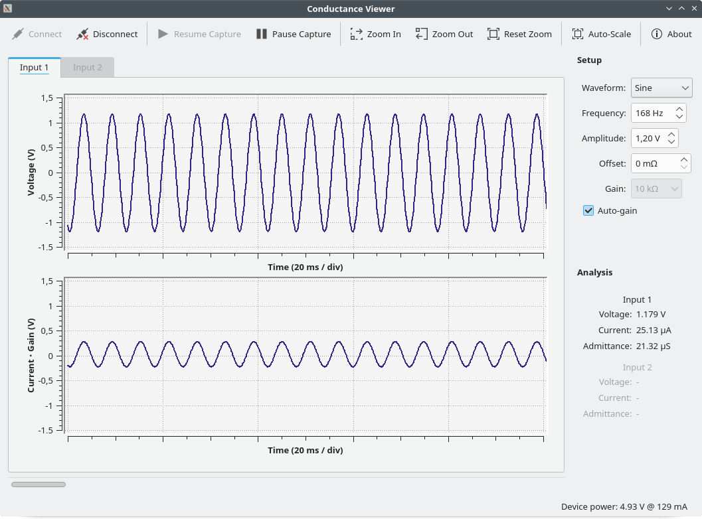
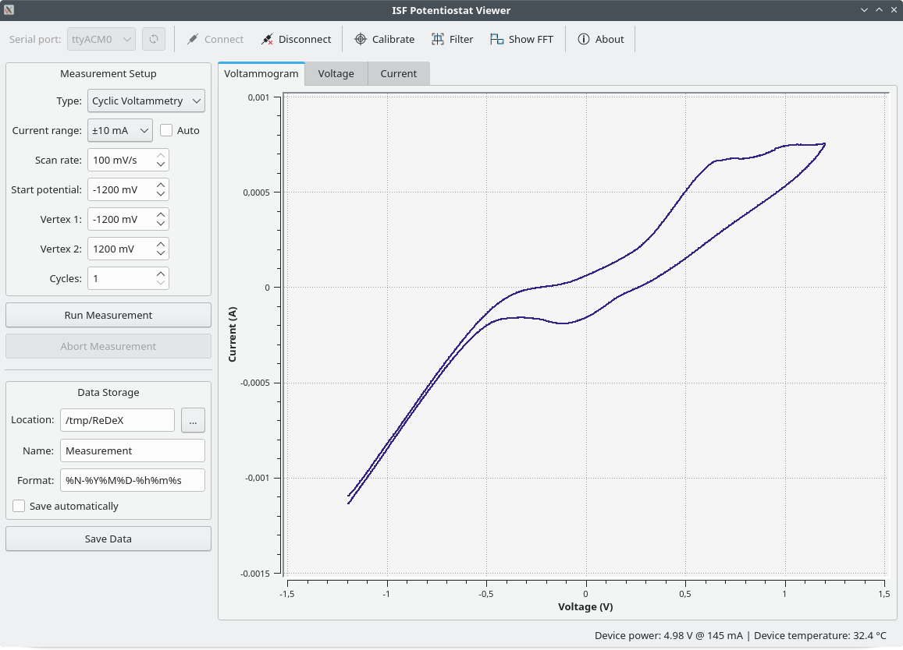
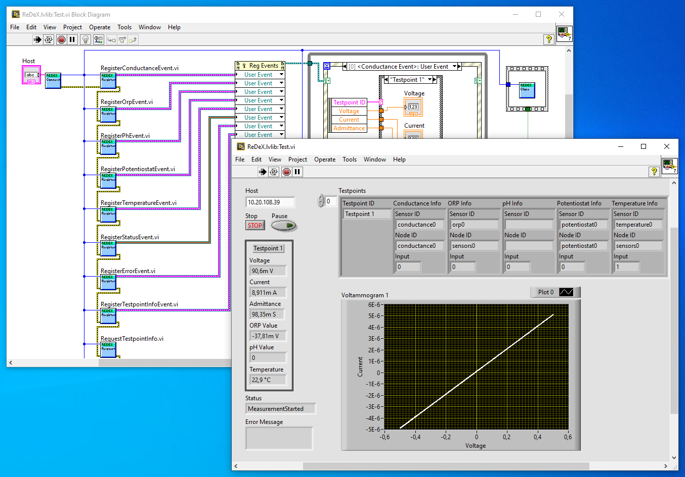

# ReDeX: Water Purification Measurements

## Introduction

This repository contains a public archive of electronics, firmware and software developed as part of the project [ReDeX](https://www.h-brs.de/de/entwicklung-einer-reduktiven-behandlungsmethode-zur-entfernung-von-desinfektionsnebenprodukten-und) that was conducted at Bonn-Rhein-Sieg University of Applied Sciences from 2019 to 2022.

The goal of this sub-project was to develop a sensor network allowing various parameters inside a water purification system to be monitored and analyzed in order to gain a better understanding of the chemical and physical processes involved.

The system is composed of sensor nodes which can be used either as standalone devices connected to a PC over USB or as a sensor network accessed over TCP/IP via a central hub. Every sensor provides complete galvanic isolation in order to prevent any possibility of cross-currents which could potentially invalidate measurements.

The parameters that can be measured include conductance, pH/ORP levels and temperature. In addition a potentiostat for cyclic voltammetry was developed, providing a compliance voltage of ±4 V and a dynamic range of approx. 1 pA to 10 mA.

Every sensor node has a corresponding user software providing a GUI for individual measurements. The complete sensor network can be accessed via the central hub by means of a shared library with optional LabVIEW integration.

## License

All source code for the software and firmware components (including the LabVIEW code) is licensed under the terms of the GNU General Public License (GPL). All schematics and CAD files for EAGLE and FreeCAD are licensed under the terms of the Creative Commons Attribution-ShareAlike International Public License (CC BY-SA). See COPYING in the respective subdirectories for details.
